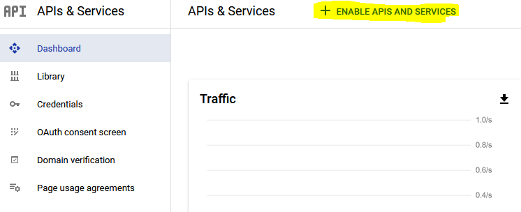
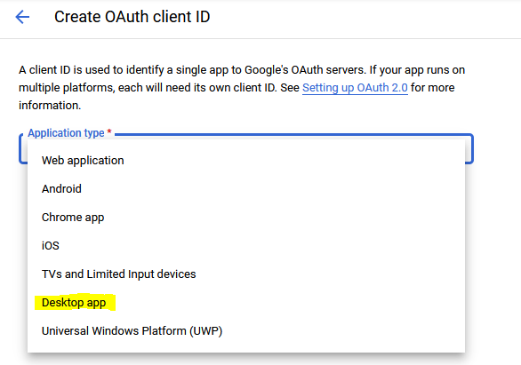
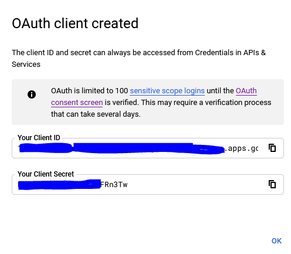

# Leetcode Scraper

The project scrapes statistics from leetcode and stores it into Google Spreadsheets.

## How to configure the scraper

### Configuration

The Configuration file template could be found in the `appsettings.json` file

```
{
  "GoogleApi": {
    "ClientId": "", // oAuth client id
    "ClientSecret": "", // oAuth client secret
    "SpreadsheetId": "" // an id of the Google Spreadsheet you need the data in
  },
  "LeetcodeApi": {
    "Cookie": "", // Cookie header value
    "CsrfToken": "", // x-csrftoken value
    "Company": "", // what company the scraper needs to get questions for
    "ChromeUserData": "Google\\Chrome\\User Data" // Get Cookie and CsrfToken from Chrome User Data folder (Cookie and CsrfToken options will be ignored when this option is set)
  }
}

```

### Configuration secrets

Configuration secrets are stored on a local machine and should never be committed to the version control system.

#### Configure secrets from Visual Studio

1. Right-click on the Scraper project
2. Select Manage User Secrets -> it will open the `secrets.json` file in your user profile.
3. Use `appsettings.json` as a template for the secrets

#### Configure secrets from the command line

1. run `dotnet user-secrets init` to create `secrets.json` file in your user profile
2. run `dotnet user-secrets set [key] [value]` to set the configuration, e.g. `dotnet user-secrets set LeetcodeApi:Company facebook`

### Google Spreadsheet API

1. Go to [Google API Console](https://console.developers.google.com/) and create a new project.
2. On the project’s dashboard click on “ + ENABLE APIS AND SERVICES”

3. From the list select “Google Sheets API”. Go with the rest of the steps to enable it.
4. Go back to the “Dashboard” and select “Credentials”.
5. Click on “+ CREATE CREDENTIALS” on the top of the page and select “OAuth client ID”
6. On the new page, from the drop-down list select “Desktop app”

7. Give it a name and it will create you a new OAuth client

8. You’ll need this data to set it in the Scrapper. 
9. Create a new Spreadsheet in Google Docs and copy its ID from the query string
10. Set it in your app secrets (or appconfig.json) in your project (Please refer to Configuration secrets section)
11. If you’re running it for the first time, uncomment the first line and comment the second like in the screenshot below:
12. Install Google Chrome (Edge won’t work) and authenticate into leedcode.com.
13. Run the Scraper.

More details in [Google documentation](https://developers.google.com/sheets/api/guides/authorizing#OAuth2Authorizing)

### Leetcode API

#### Cookies and CSRF token authentication
1. Login to [Leetcode](https://leetcode.com/)
2. Open browser console
3. Find any requests to `/graphql` endpoint in the Network tab
4. Fetch `Cookies` and `x-csrftoken` request headers and store them to the Scraper configuration

Leetcode cookies header may have some [JSON special characters](https://www.freeformatter.com/json-escape.html). Since cookies have sensitive information like a user session id and an authorization token it's better to use a local tool to escape the special characters. I'm using the [JSON escaper](https://marketplace.visualstudio.com/items?itemName=joshuapoehls.json-escaper) VS Code extension

#### Chrome User Data authentication

1. Login to [Leetcode](https://leetcode.com/) using a Chromium-based browser
2. Find the User Data folder location of the browser (for Chrome on Windows it's `%LOCALAPPDATA%\Google\Chrome\User Data`)
3. Put either full or relative path to the user data folder in the LeetcodeApi configuration

An example:
```
"ChromeUserData": "Google\\Chrome\\User Data"
```

Scraper will use the path to get the cookies and the CSRF token so the only thing you need to do is to keep yourself logged in to Leetcode in the Chromium-based browser configured in the `ChromeUserData` setting.

##### How it works

Chrome cookies are stored in SQL Lite database under `User Data\${Profile}\Cookies`. Cookie values are encrypted therefore scraper will look at another file `User Data\Local State` to get the encryption key to decrypt the cookies.

Cookies already have the CSRF token so no additional configuration needed.

##### Restrictions

The encryption algorithm used by scraper works only on Chrome > v80


### Sync leetcode submissions

#### File Sync

Your submissions could be saved to a folder on your disk drive.
To use the option just set the location where to store submission files and call `scraper.SyncSubmissionsAsync()` method.

An example of configuration option:
```
"SubmissionSync:TargetFolder": "C:\\Projects\\alex-leetcode-submissions"
```

It's also possible to configure amount of days since which you're interested to sync submissions:
```
"SubmissionSync:SinceDaysAgo": 5
```